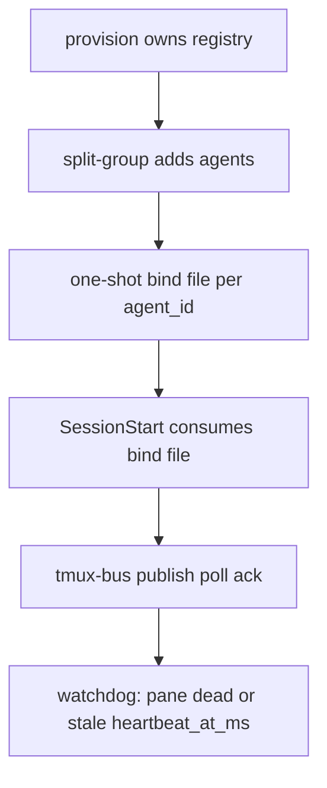

# Implementation Plan: TMUX Destack and Fault Fixes

**Status:** Destack tasks 1-17 are DONE. Spawn wiring is a follow-on section at the bottom of this file (T1-T7).

## Overview

Secondary plan on top of Option 2. Destack the tmux runtime (no hash hell, no dual writers, no heartbeat daemon) and fix the 12 direct faults. This destack body is historical. Spawn wiring for vibe/build/team is the follow-on section, not open destack work.

Count: 12 faults + 10 destack points = 20. `--cancel` is both F1 and OE10, so unique work items are 19. All 20 labels are covered below.

Keep existing LBWC `contract_digest` and `definition_sha256`. One `capability_hash` per principal in the registry (at-rest auth, not a second identity system).

Drop from tmux identity: `bootstrap_id`, `binding_token`, `bootstrap_binding_hash`, credentials-by-uuid, pane-env secrets.

Drop from tmux registry: registry-route journal, `tmux-bus.sh init` as a second creator, `tmux-bus.sh register`, `messaging_socket`.

Drop from tmux lifecycle: heartbeat daemon, `--cancel`, unused config keys, production `LBWC_TMUX_TEST_*` gates.

## Coverage

Direct faults F1-F6:

- F1 / OE10 `--cancel`: Task 10
- F2 lock `unset`: Task 1
- F3 / OE1 BSD `stat` + dual private FS: Task 3
- F4 / OE2 pane secrets + triple credentials: Task 5
- F5 watchdog `now`: Task 9
- F6 `ls` compact: Task 11

Direct faults F7-F12:

- F7 `kill_session` lock gap: Task 12
- F8 / OE4 lifecycle stub + heartbeat daemon: Task 8
- F9 doctor tmux check: Task 16
- F10 clock mix: Task 2
- F11 snapshot cancel no-op: Task 15
- F12 SMOKE overclaim: Task 17

Destack points:

- OE3 registry-route journal: Task 6
- OE5 two registry writers: Task 7
- OE6 two register paths: Task 7
- OE7 `messaging_socket`: Task 4
- OE8 unused config keys: Task 14
- OE9 production test levers: Task 2 (clock) + Task 13 (fail gates)

## Architecture Decisions

- **One filesystem helper.** `scripts/lib/tmux-private-fs.py` owns owner/mode/atomic write via `fstat` + `O_NOFOLLOW`. Shell must not call `stat -f`. Probe/read/write/delete go through the helper.
- **One capability.** Orchestrator writes `credentials/<agent_id>.json` with the raw capability before the pane starts. SessionStart reads it, calls `bind`, deletes it. `split-window -e` may set `LBWC_TMUX_AGENT`, `LBWC_TMUX_AGENT_ID`, `LBWC_TMUX_CONTRACT_ID`, `LBWC_TMUX_CONTROL_ROOT` only. Delete `scripts/tmux-agent-bootstrap.sh` if it exists only to stash secrets. Launch with `send-keys` of `claude --agent <name>`.
- **One registry writer.** `tmux-agent-orchestrator.sh provision` creates the bus. `tmux-bus.sh init` either disappears or becomes "require existing registry". `tmux-bus.sh register` is deleted. Agents enter only through `split-group`.
- **One clock.** Lock leases and deadlines use monotonic ms. Heartbeat `heartbeat_at_ms` stays wall-clock integer ms from `tmux_runtime_now_ms` with no `LBWC_TMUX_TEST_NOW_MS`. Never compare monotonic to wall.
- **No heartbeat daemon.** Delete `scripts/tmux-agent-heartbeat.sh`. SessionStart / `agent-lifecycle.sh tmux-session-start` publish one `heartbeat` after bind. Watchdog treats a dead pane or a wall-clock stale `heartbeat_at_ms` as failed.
- **Doctor output contract.** Do not renumber checks 1-20. Add `scripts/tmux-doctor.sh` and have check 20 print its PASS/WARN/FAIL detail. `--cleanup` still must not delete tmux runtime.

## Task List

### Phase 1: Foundation

## Task 1: Fix lock array release

**Description:** `tmux_runtime_lock_release` uses `unset 'TMUX_RUNTIME_LOCKS[index]'`, so the EXIT trap cannot drop the acquired lock. Use `unset "TMUX_RUNTIME_LOCKS[$index]"` and compact the array.

**Acceptance criteria:**

- Releasing a lock removes that name from `TMUX_RUNTIME_LOCKS`
- EXIT cleanup does not try to release a lock that is already gone, and does release ones still held

**Verification:** focused bats that acquire two locks, release one, assert the remaining name. `bats tests/tmux-bus.bats` subset if no dedicated file yet.

**Dependencies:** None

**Files likely touched:**

- `scripts/lib/tmux-runtime.sh`
- `tests/tmux-bus.bats`

**Estimated scope:** S

## Task 2: One clock, no production `NOW_MS`

**Description:** Lock acquire/recover/deadlines use monotonic ms only. Heartbeats keep wall-clock integer ms. Remove `LBWC_TMUX_TEST_NOW_MS` from `scripts/lib/tmux-runtime.sh` and `scripts/lbwc-statusline.sh`. Restate stale tests with fixture timestamps.

**Acceptance criteria:**

- Lock recovery cannot be steered by wall-clock injection
- Statusline stale count still works against fixture `heartbeat_at_ms`
- `LBWC_TMUX_TEST_NOW_MS` is absent from `scripts/`

**Verification:** `bats tests/tmux-bus.bats tests/statusline.bats tests/tmux-bus-watchdog.bats`

**Dependencies:** Task 1

**Files likely touched:**

- `scripts/lib/tmux-runtime.sh`
- `scripts/lbwc-statusline.sh`
- `tests/statusline.bats`
- `tests/tmux-bus.bats`
- `tests/tmux-bus-watchdog.bats`

**Estimated scope:** M

## Task 3: Single private-FS implementation

**Description:** Shell `tmux_runtime_private_*` and lock recover stop using BSD `stat -f`. They call `tmux-private-fs.py`. Tests that assert mode `700`/`600` use the helper or a portable `stat`.

**Acceptance criteria:**

- `rg 'stat -f' scripts/lib/tmux-runtime.sh scripts/tmux-*.sh` is empty
- Linux and macOS both accept a 0700/0600 runtime
- Helper remains the only writer

**Verification:** `bats tests/tmux-preflight.bats tests/tmux-bus.bats` and `python3 tests/tmux-private-fs.py`

**Dependencies:** Task 1

**Files likely touched:**

- `scripts/lib/tmux-runtime.sh`
- `scripts/lib/tmux-private-fs.py`
- `tests/tmux-bus.bats`
- `tests/tmux-private-fs.py`

**Estimated scope:** M

### Checkpoint: Foundation

- Lock release, clocks, and private FS tests pass
- No BSD `stat` left in tmux runtime
- Review before identity destack

### Phase 2: Identity and registry destack

## Task 4: Strip `messaging_socket`

**Description:** Remove unused socket fields from registry schema, routing table, split-group optional keys, and fixtures. No Claude UDS route in v1.

**Acceptance criteria:**

- Registry/routing JSON has no `messaging_socket`
- split-group rejects extra keys rather than accepting a socket field

**Verification:** `bats tests/tmux-bus.bats tests/tmux-orchestrator.bats tests/statusline.bats`

**Dependencies:** Task 3

**Files likely touched:**

- `scripts/lib/tmux-runtime.sh`
- `scripts/tmux-agent-orchestrator.sh`
- `scripts/tmux-bus.sh`
- `tests/tmux-bus.bats`
- `tests/statusline.bats`

**Estimated scope:** S

## Task 5: One capability, no pane secrets

**Description:** Drop `binding_token`, `bootstrap_binding_hash`, `bootstrap_id`, and pane `-e` secrets. Orchestrator writes `credentials/<agent_id>.json`, SessionStart binds and deletes it. Delete `scripts/tmux-agent-bootstrap.sh`. Keep one `capability_hash` in the registry.

**Acceptance criteria:**

- `split-window -e` does not pass capability or binding
- Bind is one-shot and fails if the file is missing, reused, or mismatched
- `rg 'bootstrap_binding|BOOTSTRAP_ID|BINDING_TOKEN' scripts/` is empty

**Verification:** `bats tests/session-start.bats tests/tmux-orchestrator.bats`

**Dependencies:** Task 4

**Files likely touched:**

- `scripts/tmux-agent-orchestrator.sh`
- `scripts/session-start.sh`
- `scripts/tmux-bus.sh`
- `scripts/lib/tmux-runtime.sh`
- `tests/session-start.bats`

**Estimated scope:** M

## Task 6: Delete registry-route journal

**Description:** `tmux_runtime_write_registry_route_bundle` writes registry then routing table atomically via the helper. Delete journal path, recover-on-read, and tests that plant `transactions/registry-route.json`.

**Acceptance criteria:**

- No `registry-route.json` under the bus
- A failed routing write does not leave a journal to "complete" a bad registry
- Malformed registry still fails closed

**Verification:** `bats tests/tmux-bus.bats tests/tmux-orchestrator.bats`

**Dependencies:** Task 5

**Files likely touched:**

- `scripts/lib/tmux-runtime.sh`
- `scripts/tmux-bus.sh`
- `scripts/tmux-agent-orchestrator.sh`
- `tests/tmux-bus.bats`

**Estimated scope:** M

## Task 7: One writer, one registration path

**Description:** Provision is the only registry creator. Remove or shrink `tmux-bus.sh init` so it cannot mint a second registry. Delete `tmux-bus.sh register`. Tests bootstrap through provision or a test fixture that calls the same write helper.

**Acceptance criteria:**

- `tmux-bus.sh register` is gone
- `init` does not create `registry.json` if provision did not
- split-group is the only agent add path

**Verification:** `bats tests/tmux-bus.bats tests/tmux-orchestrator.bats`

**Dependencies:** Task 6

**Files likely touched:**

- `scripts/tmux-bus.sh`
- `scripts/tmux-agent-orchestrator.sh`
- `tests/tmux-bus.bats`
- `tests/tmux-orchestrator.bats`

**Estimated scope:** M

### Checkpoint: Identity

- One capability, one registry writer, no journal, no sockets
- SessionStart bind still works
- Review before daemon deletion

### Phase 3: Lifecycle destack and remaining faults

## Task 8: Replace heartbeat daemon with bind-time heartbeat

**Description:** Delete `scripts/tmux-agent-heartbeat.sh`. SessionStart after bind, and `agent-lifecycle.sh tmux-session-start`, publish one bus heartbeat and require a bound `claude_session_id`. SessionStop stops calling the worker. Watchdog uses pane liveness plus wall-clock `heartbeat_at_ms`.

**Acceptance criteria:**

- `tmux-agent-heartbeat.sh` is gone
- malformed registry still prints `tmux_lifecycle_status=malformed`
- bound start prints `tmux_lifecycle_status=running` and updates `heartbeat_at_ms`
- no perl `setsid` worker

**Verification:** `bats tests/session-start.bats tests/agent-lifecycle.bats tests/tmux-bus-watchdog.bats`

**Dependencies:** Task 7

**Files likely touched:**

- `scripts/session-start.sh`
- `scripts/session-stop.sh`
- `scripts/agent-lifecycle.sh`
- `scripts/tmux-bus-watchdog.sh`
- `tests/agent-lifecycle.bats`

**Estimated scope:** M

## Task 9: Watchdog timestamps are integer ms

**Description:** `persist_shutdown` must not use jq `now`. Use `tmux_runtime_now_ms`. Do not add `shutdown_completed_at_ms` unless the registry schema already allows it. Prefer existing shutdown fields only.

**Acceptance criteria:**

- Watchdog persist succeeds against `tmux_runtime_registry_valid`
- No float Unix-seconds written into the registry

**Verification:** `bats tests/tmux-bus-watchdog.bats`

**Dependencies:** Task 8

**Files likely touched:**

- `scripts/tmux-bus-watchdog.sh`
- `tests/tmux-bus-watchdog.bats`

**Estimated scope:** S

## Task 10: Delete orchestrator `--cancel`

**Description:** Remove the flag and the tests that call `provision --cancel`. Cancellation stays in `scripts/runtime-snapshot.sh` `cancel` (Task 15), not as a silent orchestrator success.

**Acceptance criteria:**

- Unknown `--cancel` is usage/error
- No subcommand can exit 0 as `{state: cancelled}` without doing work

**Verification:** `bats tests/tmux-orchestrator.bats tests/execution-backend-command.bats`

**Dependencies:** Task 7

**Files likely touched:**

- `scripts/tmux-agent-orchestrator.sh`
- `tests/tmux-orchestrator.bats`

**Estimated scope:** S

## Task 11: Compact without `ls`

**Description:** `compact_directory` must not use `for file in $(ls ...)`. Use a bash glob array or the private-fs helper.

**Acceptance criteria:**

- Compact still retains N newest JSON files
- Names with spaces do not split

**Verification:** `bats tests/tmux-bus.bats`

**Dependencies:** Task 3

**Files likely touched:**

- `scripts/tmux-bus.sh`
- `tests/tmux-bus.bats`

**Estimated scope:** S

## Task 12: Keep registry lock across external teardown

**Description:** Unmanaged `kill_session` must not `lock_release` then kill panes then `lock_acquire`. Snapshot under lock, kill panes, persist under the same lock or re-read and fail closed if the roster changed.

**Acceptance criteria:**

- Concurrent provision/split cannot interleave mid-teardown
- External session still preserved, only LBWC panes die

**Verification:** `bats tests/tmux-orchestrator.bats`

**Dependencies:** Task 1

**Files likely touched:**

- `scripts/tmux-agent-orchestrator.sh`
- `tests/tmux-orchestrator.bats`

**Estimated scope:** S

## Task 13: Remove production fail-injection env vars

**Description:** Delete `LBWC_TMUX_TEST_FAIL_LAYOUT`, `FAIL_REGISTRY_WRITE`, `FAIL_ROUTING_WRITE`, `FAIL_HEARTBEAT_TERMINATION` from production scripts. Layout/registry failure tests use a PATH shim or a mock `tmux`/`python3` that returns non-zero, not an env gate inside product code.

**Acceptance criteria:**

- `rg 'LBWC_TMUX_TEST_' scripts/` is empty
- rollback-on-layout-failure still has a test

**Verification:** `bats tests/tmux-orchestrator.bats tests/session-start.bats`

**Dependencies:** Task 8

**Files likely touched:**

- `scripts/tmux-agent-orchestrator.sh`
- `scripts/lib/tmux-runtime.sh`
- `tests/tmux-orchestrator.bats`
- `tests/session-start.bats`

**Estimated scope:** M

### Checkpoint: Lifecycle

- No heartbeat daemon, no `--cancel`, no test env gates in `scripts/`
- Watchdog and teardown hold locks and write integer ms
- Review before config/docs

### Phase 4: Config, doctor, honesty

## Task 14: Remove unused tmux config keys

**Description:** Delete `session_timeout_seconds` and `pane_base_index` from `config/settings.json`, `scripts/lbwc-config.sh`, `commands/config.md`, migrate defaults, and tests. Do not implement idle-kill or pane-index behavior.

**Acceptance criteria:**

- Config validation rejects those keys if present, or migrate strips them
- `layout`, `max_agents`, heartbeat intervals remain

**Verification:** `bats tests/lbwc-execution-config.bats tests/runtime-snapshot.bats`

**Dependencies:** None (can overlap Phase 3)

**Files likely touched:**

- `config/settings.json`
- `scripts/lbwc-config.sh`
- `scripts/migrate-config.sh`
- `commands/config.md`
- `tests/lbwc-execution-config.bats`

**Estimated scope:** S

## Task 15: Persist snapshot cancel

**Description:** `runtime-snapshot.sh cancel` writes a durable cancelled marker in the phase dir (for example `.runtime-cancelled.json`) and refuses if a ready `.runtime-snapshot.json` already exists. It still must not freeze a backend.

**Acceptance criteria:**

- Cancel is visible on disk
- Cancel after freeze is an error
- vibe/build copy that cites cancel still matches helper output

**Verification:** `bats tests/runtime-snapshot.bats`

**Dependencies:** None

**Files likely touched:**

- `scripts/runtime-snapshot.sh`
- `tests/runtime-snapshot.bats`
- `commands/vibe.md` (only if the cancel contract text must name the marker)

**Estimated scope:** S

## Task 16: Real doctor tmux helper

**Description:** Add `scripts/tmux-doctor.sh` that validates registry, routes, session/pane existence, and stale heartbeats. `commands/doctor.md` check 20 prints that result. Do not renumber 1-20. `--cleanup` still cannot delete tmux state.

**Acceptance criteria:**

- Malformed registry is WARN/FAIL from the helper, not freeform prose
- Output format block still has checks 1-20
- `tests/doctor.bats` covers missing vs malformed vs healthy

**Verification:** `bats tests/doctor.bats`

**Dependencies:** Task 3, Task 8

**Files likely touched:**

- `scripts/tmux-doctor.sh`
- `commands/doctor.md`
- `tests/doctor.bats`

**Estimated scope:** M

## Task 17: Honest SMOKE rows

**Description:** `SMOKE-TESTS.md` must not cite `/tmp/lbwc-*.md` as PASS evidence. Automated tmux rows point at bats files in this repo. Interactive Option 2 rows stay PENDING. Do not claim a full-suite count unless that invocation is re-run in the same change.

**Acceptance criteria:**

- No `/tmp/` evidence paths in Automated or TMUX Smoke Scope
- Interactive split-pane identity remains PENDING

**Verification:** read the matrix. No new passing claim without a repo path.

**Dependencies:** Tasks 1-16 (write last so the cited bats exist)

**Files likely touched:**

- `SMOKE-TESTS.md`

**Estimated scope:** S

### Checkpoint: Complete

- All 20 labels mapped and done
- `rg 'LBWC_TMUX_TEST_|bootstrap_binding|messaging_socket|registry-route|--cancel' scripts/` is empty
- `bats tests/tmux-*.bats tests/session-start.bats tests/agent-lifecycle.bats tests/statusline.bats tests/doctor.bats tests/runtime-snapshot.bats tests/lbwc-execution-config.bats`
- Original Option 2 plan still owns vibe/build/team spawn wiring. See the follow-on section. Destack itself does not reopen that work.

## Out of scope

- Connecting `commands/vibe.md` / `commands/build.md` / `commands/team.md` to `provision` / `split-group`
- Editing `references/vibe-mode-execute.md`
- Claude cross-session UDS / `SendMessage`
- Expanding `references/tmux-spawn-protocol.md` beyond destack (original plan)
- Committing or version bump

## Risks and Mitigations

| Risk | Impact | Mitigation |
|------|--------|------------|
| Orchestrator + bus tests are coupled to journal, `--cancel`, and fail env vars | High | Destack will delete tests, not skip them. Rewrite those cases in the same task. |
| Doctor 1-20 is product UI | High | Adding a 21st check is forbidden. Helper under check 20 only. |
| GitNexus impact | Med | Run `impact` on `tmux_runtime_lock_release`, `provision`, `command_init`, `bind_tmux_bootstrap` before edits. Warn on HIGH/CRITICAL. |
| `contract_digest` | High | Do not touch it. That is core LBWC, not tmux hash hell. |

## Spawn wiring (follow-on, DONE)

Destack is closed. Remaining Option 2 work was live spawn: schema 3 contracts from the frozen snapshot, destack-correct protocol text, then vibe/build/team dispatch through provision and split-group when the user chooses tmux.

- **T1 DONE:** `task-contract.sh open` writes schema 3 from CLI flags plus `--assert-snapshot`. Tests in `tests/task-contract.bats`.
- **T2 DONE:** `references/tmux-spawn-protocol.md` rewritten to destack bind-file + split-group.
- **T3 DONE:** `commands/build.md` tmux branch: open flags, provision, split-group, bus.
- **T4 DONE:** vibe execute + `references/vibe-mode-execute.md` use the same tmux dispatch.
- **T5 DONE:** Team: user chooses native vs tmux fresh pane sessions.
- **T6 DONE:** `indexer-sync.sh` wired into `commands/init.md`.
- **T7 DONE:** Interactive Claude Code SMOKE rows stay PENDING. Automated table cites `tests/runtime-snapshot.bats` markdown contracts and `tests/team-command.bats` execution-choice. No `/tmp` PASS claims. No interactive PASS without consumer-session evidence.
